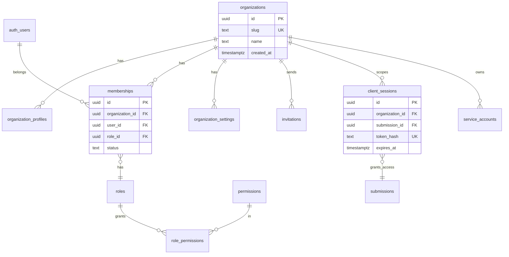
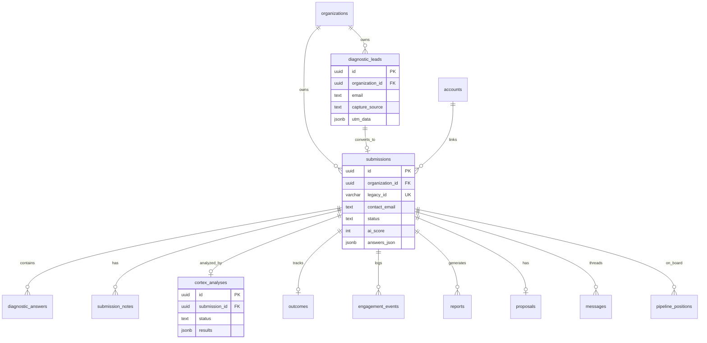
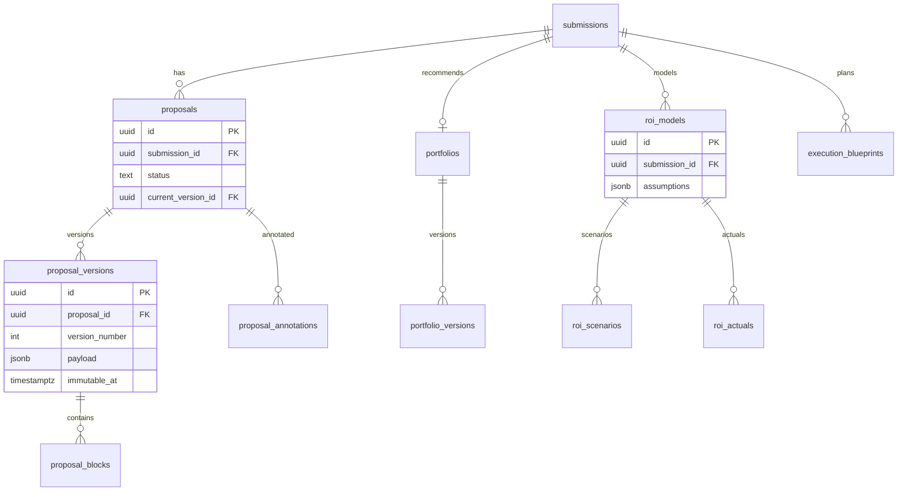
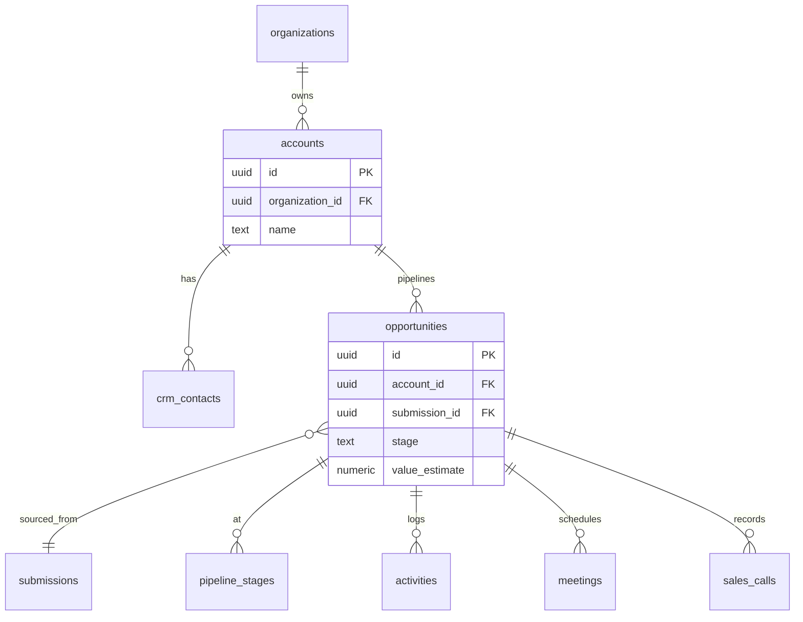
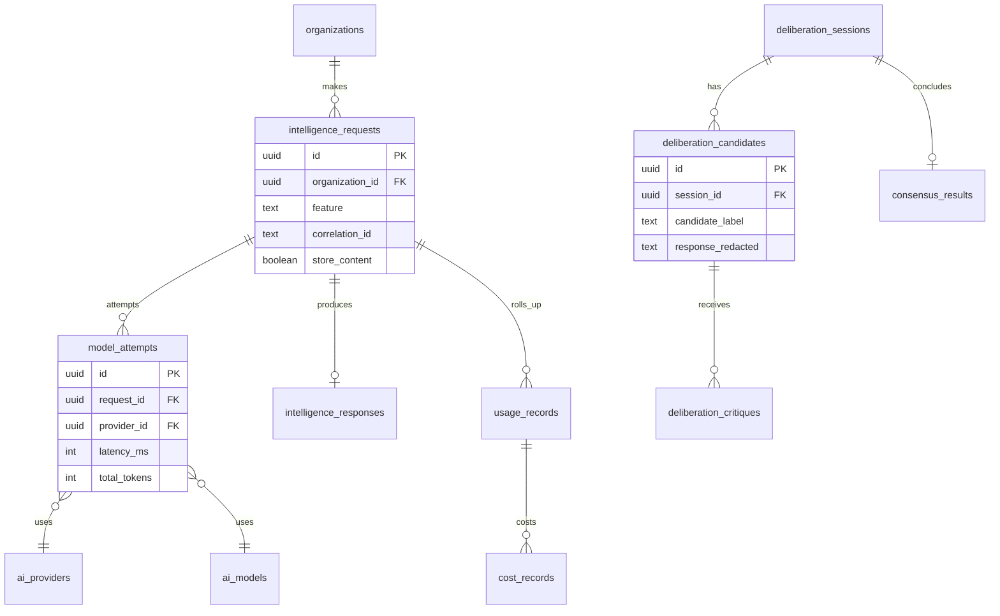
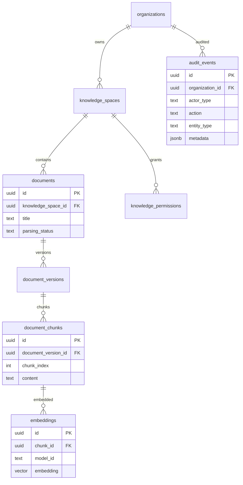
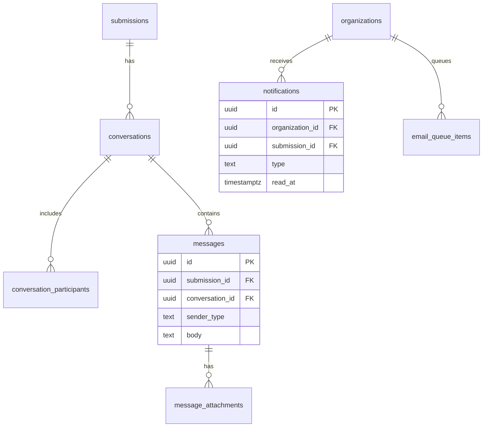

# MCV2-S3 — Entity Relationship Diagrams

**Sprint:** `MCV2-S3-DATABASE-ARCHITECTURE`  
**Format:** Mermaid ER diagrams split by bounded domain  
**Note:** Diagrams show logical model; not all tables ship in Sprint 1.

---

## Diagram 1 — Identity, tenancy, and auth

---

## Diagram 2 — Diagnostic core (KV migration priority)

---

## Diagram 3 — Proposal, commercial, ROI

---

## Diagram 4 — CRM and revenue (future)

**Canonical rule:** `diagnostic_leads` (funnel) → `submissions` → `accounts`/`opportunities` (CRM). No duplicate lead authority.

---

## Diagram 5 — AI platform and deliberation

**Privacy:** `deliberation_candidates` never stores `provider_id`. Provider identity lives in `model_attempts` (admin-only RLS).

---

## Diagram 6 — Knowledge, RAG, audit

---

## Diagram 7 — Communication

---

## KV → relational quick reference

| KV key | Primary table(s) |
|--------|------------------|
| `sub:*` | `submissions`, `diagnostic_answers` |
| `lead:*` | `diagnostic_leads` |
| `client_session:*` | `client_sessions` |
| `proposal:*` | `proposals`, `proposal_versions` |
| `cortex:*` | `cortex_analyses` |
| `msg:*` | `messages` |
| `note:*` | `submission_notes` |
| `eng_log:*` | `engagement_events` |
| `outcome:*` | `outcomes` |
| `notif:*` | `notifications` |
| `emailq:*` | `email_queue_items` |
| `settings:platform` | `organization_settings` |
| `cortex:pipeline:positions` | `pipeline_positions` |

---

*End of ERD document*
