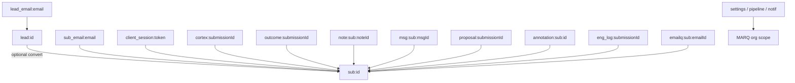

# MCV2-S6.1-PLAN-003 — KV Backfill & Reconciliation Architecture

**Sprint:** `MCV2-S6.1-PLAN-003`  
**Status:** Planning only — no production code, no runtime changes, no data migration  
**Date:** 2026-07-14  
**Authority:** KV (`kv_store_324f4fbe`) remains authoritative until per-domain Phase 5 cutover (Migration Roadmap Phase 2–3)

**Sources read:**

| Document | Path |
|----------|------|
| Agent operating contract | `prompts/MARQ-CLAUDE-AGENT-SYSTEM-PROMPT-v1.0.md` |
| Repository map | `ARCHITECT.md` |
| Machine snapshot | `architecture/system_map.json` |
| Data platform architecture | `src/imports/MCV2-S3-CORTEX-DATA-PLATFORM-ARCHITECTURE.md` |
| Migration roadmap | `architecture/database/MCV2-S3-MIGRATION-ROADMAP.md` |
| KV mapping (S5) | `architecture/database/MCV2-S5-KV-RELATIONAL-MAPPING.md` |
| S4 completion | `architecture/database/MCV2-S4-IMPLEMENT-001-COMPLETION.md` |
| S5 completion | `architecture/database/MCV2-S5-IMPLEMENT-002-COMPLETION.md` |
| S5 validation | `architecture/database/MCV2-S5-VALIDATE-001-COMPLETION.md` |

**Note:** `MARQ_CORTEX_CONSTITUTION.md` was not found in the repository. Operating principles are taken from the agent system prompt (§5 architecture protection, §7 data gateway rule, §8 evidence) and S3 data platform principles.

---

## Executive summary

This document defines the **permanent KV Backfill & Reconciliation Engine** for MARQ Cortex V2. The engine migrates data from `kv_store_324f4fbe` into normalized PostgreSQL tables already deployed by S4 (tenancy) and S5 (diagnostic domain), with future domains added incrementally.

**Scope of S6.1:** Architecture and implementation plan only.  
**First implementation target (S6.2+):** Diagnostic domain — `lead:*`, `sub:*`, `outcome:*`, `cortex:*` (scores), client reports.

**Golden rules (inherited):**

1. KV is authoritative until Phase 5 cutover per domain.
2. Backfill is idempotent via `legacy_kv_key` upsert.
3. No dual-read or dual-write until reconciliation passes.
4. `kv_store.tsx` and Hono routes are not modified during backfill sprints.
5. All backfill runs use service role; RLS is bypassed intentionally with org scoping in engine logic.

---

# Part 1 — Stage 1: KV Namespace Audit

## 1.1 Storage model

| Item | Value | Evidence |
|------|-------|----------|
| Table | `public.kv_store_324f4fbe` | `supabase/migrations/20260713000000_kv_store_foundation.sql` |
| Schema | `key TEXT PK`, `value JSONB` | `kv_store.tsx` header comment |
| Access | Service role only (no RLS) | `kv_store.tsx`, S3 audit |
| Query pattern | Prefix scan via `LIKE 'prefix%'` | `getByPrefix()` |

## 1.2 Complete namespace inventory

Record counts are **UNVERIFIED** until Phase 0 inventory script runs against staging/production. Counts below are structural expectations from code, not live measurements.

### Tier A — Diagnostic domain (S5 tables exist; backfill Phase 2 priority)

| Namespace | Key pattern | Entity | Cardinality | Authoritative? | SQL destination | Runtime usage |
|-----------|-------------|--------|-------------|----------------|-----------------|---------------|
| `lead:` | `lead:{leadId}` | Lead magnet / exit-intent capture | 1 per lead | **Yes** | `leads` (+ optional `contacts`) | `POST /leads/capture`, `/leads/exit-intent` |
| `lead_email:` | `lead_email:{email}` | Email → leadId index | 1 per email | Index only | `leads.email` unique per org | Dedup on exit-intent |
| `sub:` | `sub:{SUB-*}` | Diagnostic submission blob | 1 per submission | **Yes** | `submissions` + children | All submission routes |
| `sub_email:` | `sub_email:{email}` | Email → submissionId index | 1 per email (last write wins) | Index only | `submissions.contact_email` lookup | Client auth verify |
| `outcome:` | `outcome:{submissionId}` | Post-sale outcome | 0–1 per submission | **Yes** | `outcomes` | Outcome CRUD |
| `cortex:` | `cortex:{submissionId}` | AI analysis result | 0–1 per submission | **Yes** | `diagnostic_scores` + `domain_scores` | Analysis routes, client report |

### Tier B — Submission-scoped (schema planned S6+; not in S5)

| Namespace | Key pattern | Entity | SQL destination (planned) |
|-----------|-------------|--------|---------------------------|
| `note:` | `note:{submissionId}:{noteId}` | Team note | `submission_notes` |
| `msg:` | `msg:{submissionId}:{msgId}` | Client/team message | `messages` |
| `msg_read:` | `msg_read:{submissionId}` | Read watermark | `conversation_participants.last_read_at` |
| `proposal:` | `proposal:{submissionId}` | Proposal document | `proposals` + `proposal_versions` |
| `annotation:` | `annotation:{submissionId}:{id}` | Proposal annotation | `proposal_annotations` |
| `eng_log:` | `eng_log:{submissionId}` | Engagement array (max 50) | `engagement_events` |
| `emailq:` | `emailq:{submissionId}:{emailId}` | Email nurture queue item | `email_queue_items` |

### Tier C — Global / platform

| Namespace | Key pattern | Entity | SQL destination (planned) |
|-----------|-------------|--------|---------------------------|
| `notif:` | `notif:{timestamp}-{rand}` | In-app notification | `notifications` |
| `notification:` | `notification:*` | **Legacy duplicate prefix** | Merge → `notifications` |
| `notifs_last_read_at` | singleton | Global read watermark | `notification_read_states` |
| `settings:platform` | singleton | Platform settings | `organization_settings` |
| `cortex:pipeline:positions` | singleton | Kanban positions | `pipeline_positions` |
| `cortex:column:capacities` | singleton | Column WIP limits | `pipeline_column_settings` |

### Tier D — Ephemeral / duplicate authority

| Namespace | Key pattern | Entity | Migration strategy |
|-----------|-------------|--------|-------------------|
| `client_session:` | `client_session:{token}` | Client portal session (8h TTL) | **Skip backfill** — greenfield `client_sessions` on dual-write sprint |
| `team:member:{userId}` | per user | Invited member cache | **Deprecate** — Supabase Auth + `organization_memberships` is authoritative |
| `eng:` | `eng:{submissionId}:{eventId}` | Documented in registry | **Unused** in `index.tsx` — inventory only |

## 1.3 Entity schemas (KV JSON)

### `lead:{id}`

```json
{
  "id": "lead_1739..._abc | lead_exit_1739..._abc",
  "name": "string (optional)",
  "email": "string (required)",
  "phone": "string (optional)",
  "website": "string (optional)",
  "source": "lead_magnet | exit_intent",
  "capturedAt": "ISO8601"
}
```

**Storage quirk:** Values are double-encoded — `JSON.stringify(lead)` stored in JSONB (`index.tsx` L580, L637).

### `sub:{id}`

```json
{
  "id": "SUB-{timestamp}-{RAND5}",
  "company": "string",
  "contact": "string",
  "email": "lowercase email",
  "phone": "string",
  "website": "string",
  "industry": "label",
  "industryId": "registry key",
  "employees": "string",
  "revenue": "string",
  "submittedAt": "ISO8601",
  "submittedDate": "locale string",
  "status": "new | under_review | ...",
  "priority": "low | medium | high | urgent",
  "completionScore": 0-100,
  "qualityScore": 0-100,
  "aiScore": 0-100,
  "roiPotential": "string",
  "answers": { "questionKey": "answer text" },
  "isRead": boolean
}
```

**Storage quirk:** Double-encoded JSON string in JSONB.

### `cortex:{submissionId}`

AI analysis blob with fields including `status`, `readinessScore`, `pillarHeatmap`, `coreProblems`, `recommendation`, `riskFlags`, `roiEstimate`. Maps to `diagnostic_scores` + `domain_scores` (pillar keys → domain_key).

### `outcome:{submissionId}`

Deal outcome object; 1:1 with submission. Full payload → `outcomes.value` JSONB.

### Index keys (`*_email:`)

Value is a **plain string** (leadId or submissionId), not JSON.

## 1.4 Relationships (current KV graph)



## 1.5 Malformed record patterns (expected)

| Pattern | Detection | Remediation |
|---------|-----------|-------------|
| Double-encoded JSON string | `typeof value === 'string'` after JSONB read | `safeJsonParse()` — already in `index.tsx` |
| Missing required fields (`email`, `id`) | Schema validator | Quarantine row; log to `migration_quarantine` |
| Invalid status/priority enum | Normalizer maps unknown → default + metadata flag | Store raw in `metadata.kv_status_raw` |
| `sub_email:` points to missing `sub:` | FK orphan check | Quarantine index; do not create submission |
| Duplicate `sub_email:` for same email | Last KV write wins today | Backfill picks latest `submittedAt`; log prior IDs |
| `lead_email:` collision (exit-intent dedup) | Multiple `lead:` same email | Keep earliest `capturedAt`; merge metadata |
| Score out of range | `completionScore` etc. not 0–100 | Clamp + flag in metadata |
| Legacy `notification:` prefix | Prefix scan pollution | Normalize prefix; merge into `notif:` handling |

## 1.6 Duplicate patterns

| Pattern | Type | Resolution |
|---------|------|------------|
| `notification:` vs `notif:` | Prefix drift | Single normalizer; dedupe by `(type, submissionId, createdAt)` |
| `team:member:*` vs Auth | Authority duplicate | Skip backfill; delete KV cache post-cutover |
| Email index overwrite | `sub_email:` / `lead_email:` | Document as index-only; relational uses unique constraint on org+email |
| Re-submission same email | Multiple `sub:*` | All subs preserved; email lookup returns latest by `submittedAt` |
| `eng:` vs `eng_log:` | Registry vs runtime | Only `eng_log:` is authoritative |

## 1.7 Phase 0 inventory deliverables (pre-backfill gate)

Before any backfill run:

1. **Inventory script** — `scripts/migration/kv-inventory.ts` (read-only)
2. **Report:** counts per prefix, avg payload bytes, malformed %, duplicate email count
3. **Fixtures:** anonymized samples in `architecture/database/fixtures/kv/`
4. **Baseline checksums:** SHA-256 per prefix over canonical JSON (sorted keys)

**Exit criterion:** Malformed < 1% per prefix or documented quarantine plan approved.

---

# Part 2 — Stage 2: Backfill Engine Architecture

## 2.1 Design goals

| Goal | Mechanism |
|------|-----------|
| Idempotency | Upsert on `legacy_kv_key`; deterministic UUID v5 option for child rows |
| Resumability | Checkpoint table + cursor per namespace |
| Safety | Dry-run mode; no KV writes ever |
| Observability | Structured telemetry → `migration_runs`, `migration_checkpoints`, `migration_reconciliation_log` |
| Isolation | All rows scoped to `cortex.marq_organization_id()` during single-tenant phase |
| Testability | Fixture-driven unit tests; staging dry-run before production |

## 2.2 High-level architecture

```
┌─────────────────────────────────────────────────────────────────┐
│                    Backfill CLI / Edge Job                       │
│  npm run migration:backfill -- --domain=diagnostic --dry-run       │
└────────────────────────────┬────────────────────────────────────┘
                             │
         ┌───────────────────┼───────────────────┐
         ▼                   ▼                   ▼
┌─────────────────┐ ┌─────────────────┐ ┌─────────────────┐
│ BackfillOrchestrator │ │ CheckpointStore │ │ TelemetryEmitter │
└────────┬────────┘ └────────┬────────┘ └────────┬────────┘
         │                   │                   │
         ▼                   ▼                   ▼
┌─────────────────────────────────────────────────────────────────┐
│              Domain Backfill Modules (pluggable)                 │
│  LeadBackfill │ SubmissionBackfill │ OutcomeBackfill │ ...       │
└────────────────────────────┬────────────────────────────────────┘
                             │
         ┌───────────────────┼───────────────────┐
         ▼                   ▼                   ▼
┌─────────────────┐ ┌─────────────────┐ ┌─────────────────┐
│ KvReader        │ │ Normalizer      │ │ SqlWriter       │
│ (read-only)     │ │ (pure functions)│ │ (repositories)  │
└─────────────────┘ └─────────────────┘ └─────────────────┘
         │                                       │
         ▼                                       ▼
   kv_store_324f4fbe                    PostgreSQL (S4/S5 tables)
```

## 2.3 Module layout (proposed files)

| Module | Path | Responsibility |
|--------|------|----------------|
| Orchestrator | `supabase/functions/server/migration/backfillOrchestrator.ts` | Run lifecycle, domain ordering, error policy |
| CLI entry | `scripts/migration/run-backfill.ts` | Deno/Node wrapper; parses flags |
| KV reader | `supabase/functions/server/migration/kvReader.ts` | Paginated prefix scan; never calls `set`/`del` |
| Normalizer | `supabase/functions/server/migration/normalizers/` | Pure transforms per entity |
| SQL writer | `supabase/functions/server/migration/sqlWriter.ts` | Uses existing repositories + service client |
| Checkpoint | `supabase/functions/server/migration/checkpointStore.ts` | Read/write checkpoint rows |
| Telemetry | `supabase/functions/server/migration/telemetry.ts` | Run metrics, structured logs |
| Reconciler | `supabase/functions/server/migration/reconcile.ts` | Post-backfill validation (Part 3) |
| Types | `supabase/functions/server/migration/types.ts` | Shared contracts |
| Registry | `supabase/functions/server/migration/domainRegistry.ts` | Domain → module → table mapping |

**Manifest IDs (register before implementation):** `MQC-MIG-001` through `MQC-MIG-010`

## 2.4 Domain backfill order (within diagnostic sprint)

```
1. contacts (derived)     ← from lead + sub emails
2. leads                    ← lead:*
3. submissions              ← sub:*
4. submission_sections      ← derived from question registry + answers
5. diagnostic_answers       ← sub.answers
6. diagnostic_scores        ← sub scores + cortex analysis
7. domain_scores            ← cortex.pillarHeatmap
8. outcomes                 ← outcome:*
9. reports + report_versions ← built from client report route logic (optional Phase 2b)
```

**Dependency rule:** Parent `submissions` row must exist before children. `leads` before `submissions.lead_id` link (match by email + time window).

## 2.5 Batching strategy

| Parameter | Default | Rationale |
|-----------|---------|-----------|
| `batchSize` | 50 keys | Edge function memory limit; repo insert batch |
| `prefixCursor` | Last processed `key` lexicographic | Resume within prefix |
| `parallelism` | 1 (sequential) | Avoid FK races; increase in CLI-only runs |
| `transactionScope` | Per submission aggregate | Submission + answers + scores in one DB transaction |
| `throttleMs` | 100ms between batches | Protect Supabase connection pool |

**Pagination:** KV reader uses `SELECT key, value FROM kv_store_324f4fbe WHERE key LIKE $1 AND key > $2 ORDER BY key LIMIT $3` — requires new read helper (does not modify protected `kv_store.tsx`; add `migration/kvReader.ts` with direct service client query).

## 2.6 Checkpoint model

### Table: `migration_checkpoints` (new migration)

| Column | Type | Purpose |
|--------|------|---------|
| `id` | UUID PK | Checkpoint row |
| `run_id` | UUID FK → `migration_runs` | Parent run |
| `domain` | TEXT | e.g. `diagnostic.leads` |
| `prefix` | TEXT | KV prefix |
| `last_key` | TEXT | Cursor |
| `records_processed` | BIGINT | Counter |
| `records_written` | BIGINT | Counter |
| `records_quarantined` | BIGINT | Counter |
| `status` | TEXT | `running` \| `paused` \| `completed` \| `failed` |
| `updated_at` | TIMESTAMPTZ | Heartbeat |

**Checkpoint frequency:** After every successful batch commit.

## 2.7 Resume protocol

1. Load latest `migration_runs` row for `(domain, environment)`.
2. If `status = failed` or `paused`, read `migration_checkpoints.last_key`.
3. Skip keys `<= last_key` in prefix scan.
4. Increment `run_id` only on explicit `--fresh-run`; otherwise continue same run.
5. Idempotent upsert ensures re-processing a batch is safe.

## 2.8 Dry-run mode

| Behavior | Dry-run (`--dry-run`) | Live |
|----------|----------------------|------|
| KV reads | Yes | Yes |
| SQL writes | No — log intended ops | Yes |
| Checkpoint update | Yes (separate `dry_run` flag on run) | Yes |
| Reconciliation | Full count compare against KV | Full |
| Output | JSON report file | DB + report |

Dry-run validates normalizers and estimates quarantine volume without side effects.

## 2.9 Telemetry

### Table: `migration_runs`

| Column | Purpose |
|--------|---------|
| `run_id`, `domain`, `environment`, `mode` (`dry_run` \| `live`) | Identity |
| `started_at`, `finished_at`, `status` | Lifecycle |
| `records_read`, `records_written`, `records_skipped`, `records_quarantined` | Counters |
| `error_summary` JSONB | First N errors |
| `checksum_kv`, `checksum_sql` | Post-run hashes |

### Emission points

- Batch start/complete (debug)
- Quarantine events (warn)
- Run complete (info) — summary to stdout + DB
- Reconciliation mismatches (error)

### Observability integration

- Structured JSON logs (Edge-compatible)
- Future: team dashboard panel (out of scope S6.1)

---

# Part 3 — Stage 3: Normalization Design

## 3.1 Normalizer pipeline (per record)

```
KV raw value
  → parseJson(value)           # handle double-encoding
  → validateShape(schema)      # required fields
  → normalizeUuid()            # generate UUID PK; preserve legacy_id
  → normalizeOrganization()    # assign organization_id
  → normalizeTimestamps()      # ISO8601, timezone UTC
  → normalizeForeignKeys()     # resolve submission_id, lead_id, contact_id
  → normalizeLegacyKvKey()     # canonical key string
  → mapToSqlRow()              # typed insert payload
  → validateSqlConstraints()   # enum, range, CHECK
```

## 3.2 Validation rules

### UUID

| Field | Rule |
|-------|------|
| SQL PK (`id`) | Generate `gen_random_uuid()` on first insert; never derive from KV string ID |
| `legacy_id` | Preserve KV `id` field exactly (`SUB-*`, `lead_*`) |
| FK references | Resolve via `legacy_kv_key` lookup map built in run context |
| Auth user FKs | `created_by` / `updated_by` = NULL for backfill (no historical user mapping) |

### Organization

| Rule | Detail |
|------|--------|
| Single-tenant default | All rows → `organization_id = cortex.marq_organization_id()` |
| Multi-tenant future | If KV payload ever includes `orgId`, validate against membership; else default |
| Null org | **Reject** — quarantine |

### Timestamps

| KV field | SQL column | Rule |
|----------|------------|------|
| `capturedAt` | `leads.captured_at` | Parse ISO8601; fallback `now()` + flag |
| `submittedAt` | `submissions.submitted_at` | Parse ISO8601; fallback file mtime unavailable → quarantine |
| `submittedDate` | metadata only | Locale string — not used as authoritative |
| Missing timestamps | — | Default to `now()` at backfill time + `metadata.backfill_timestamp_inferred = true` |

All timestamps stored as `TIMESTAMPTZ` UTC.

### Foreign keys

| FK | Resolution |
|----|------------|
| `submissions.lead_id` | Match `leads.email = sub.email` AND `leads.captured_at <= sub.submitted_at`; earliest match |
| `submissions.contact_id` | Upsert `contacts` by `(org, primary_email)` during contact derivation pass |
| `diagnostic_answers.submission_id` | UUID from `legacy_kv_key = sub:{legacy_id}` map |
| `outcomes.submission_id` | Lookup by submission legacy_id from key suffix |
| `domain_scores.submission_id` | Same as above |
| Orphan child (no parent) | Quarantine — do not insert |

### legacy_kv_key

| Rule | Example |
|------|---------|
| Format | `{prefix}{nativeId}` — no trailing slash |
| Lead | `lead:lead_1739..._abc` |
| Submission | `sub:SUB-1739...-ABCDE` |
| Outcome | `outcome:SUB-1739...-ABCDE` |
| Uniqueness | Upsert conflict target on `legacy_kv_key` partial unique index |
| Index keys (`sub_email:`) | **Do not** store as `legacy_kv_key`; not entity rows |

### Enum normalization

| KV value | SQL value | On unknown |
|----------|-----------|------------|
| Lead source `lead_magnet` | status `captured` + source key `lead_magnet` | Map + metadata |
| Lead source `exit_intent` | status `exit_intent` | Map + metadata |
| Submission status | CHECK constraint set | Map to `new` + raw in metadata |
| Priority | CHECK constraint set | Map to `medium` |

### Scores

| Field | Rule |
|-------|------|
| `completionScore`, `qualityScore`, `aiScore` | Clamp 0–100; NULL if non-numeric |
| `pillarHeatmap.*` | Map to `domain_scores` with keys `operations_execution`, etc. |
| `readinessScore` (cortex) | Store in `diagnostic_scores.readiness_score` if numeric; else metadata |

## 3.3 Quarantine table: `migration_quarantine`

| Column | Purpose |
|--------|---------|
| `legacy_kv_key` | Source key |
| `domain` | Target domain |
| `raw_value` JSONB | Original payload |
| `error_code` | Machine-readable |
| `error_detail` | Human-readable |
| `run_id` | Backfill run |

Quarantined records are excluded from reconciliation success counts until remediated.

---

# Part 4 — Stage 4: Reconciliation Architecture

## 4.1 Reconciliation engine

Standalone module invoked after backfill (`reconcile.ts`) and on-demand (`npm run migration:reconcile`).

```
For each domain:
  1. Count compare (KV vs SQL)
  2. Key coverage (every KV authoritative key has SQL legacy_kv_key)
  3. Duplicate detection (SQL uniqueness violations)
  4. Orphan detection (child FK without parent)
  5. Checksum verification (sample + full optional)
  → Write migration_reconciliation_log
  → Exit code non-zero if hard failures
```

## 4.2 Mismatch detection

| Check | Method | Severity |
|-------|--------|----------|
| Count drift | `COUNT(kv prefix*)` vs `COUNT(sql WHERE legacy_kv_key IS NOT NULL)` | Hard fail if > 0.1% |
| Missing SQL row | KV key not in SQL by `legacy_kv_key` | Hard fail |
| Extra SQL row | SQL `legacy_kv_key` not in KV | Warn (manual SQL insert?) |
| Field drift | Normalized hash compare on sample (100 random) | Hard fail if > 1 field/submission |
| Email index drift | KV `sub_email:` resolve vs SQL latest-by-email | Warn |

**Field-level hash canonical form:**

```typescript
// Pseudocode — sorted keys, normalized email lowercase, scores as integers
hash = sha256(JSON.stringify(canonicalize(kvRecord)) === sha256(JSON.stringify(canonicalize(sqlRow)))
```

## 4.3 Duplicate detection

| Scope | Query |
|-------|-------|
| SQL `legacy_kv_key` | `GROUP BY legacy_kv_key HAVING COUNT(*) > 1` |
| SQL org+email (leads) | Unique index violation on backfill → abort batch |
| SQL org+email (submissions) | Allow multiple subs per email; index is non-unique |
| KV duplicate keys | Impossible (PK); duplicate emails via index overwrite logged |

## 4.4 Orphan detection

| Orphan type | Detection |
|-------------|-----------|
| `sub_email:` → missing `sub:` | KV inventory cross-ref |
| `outcome:` → missing `sub:` | Prefix suffix lookup |
| `diagnostic_answers` → missing `submission` | FK query |
| `domain_scores` → missing `submission` | FK query |
| `leads.lead_id` on submission | NULL allowed; warn if email match expected |

## 4.5 Checksum verification

| Level | Scope | When |
|-------|-------|------|
| L1 — Prefix count | All keys per prefix | Every run |
| L2 — Sample hash | 100 random records per domain | Every run |
| L3 — Full hash | All records | Pre-cutover gate only |
| L4 — Aggregate checksum | Single SHA256 over sorted `legacy_kv_key:hash` pairs | Stored in `migration_runs` |

**Pre-cutover gate:** L3 + L4 must pass with zero hard failures before Phase 3 dual-read.

## 4.6 Reconciliation log table

`migration_reconciliation_log`:

| Column | Purpose |
|--------|---------|
| `run_id`, `domain`, `check_type` | Identity |
| `kv_count`, `sql_count`, `delta` | Count compare |
| `sample_size`, `mismatch_count` | Sample hash |
| `orphan_count`, `duplicate_count` | Integrity |
| `status` | `pass` \| `warn` \| `fail` |
| `details` JSONB | Per-key mismatch sample (max 50) |

---

# Part 5 — Stage 5: Rollback Design

## 5.1 Rollback principles

| Principle | Detail |
|-----------|--------|
| KV never touched | Backfill rollback is SQL-only |
| Idempotent re-run | After truncate, backfill can replay from KV |
| Checkpoint preserved | Failed runs retain cursor for resume OR audit |
| Domain isolation | Roll back diagnostic without touching tenancy |

## 5.2 Rollback modes

### Mode 1 — Resume (not rollback)

- Continue from `migration_checkpoints.last_key`
- No data deletion
- Use when run interrupted (timeout, deploy)

### Mode 2 — Partial rollback

**Scope:** Single domain or prefix family.

**Steps:**

1. Set domain flag `migration_domain_status = rolled_back`.
2. `DELETE FROM {child_tables} WHERE organization_id = marq_org AND legacy_kv_key IS NOT NULL` (or submission FK cascade).
3. `DELETE FROM {parent_table}` same condition.
4. Clear checkpoint for that domain.
5. KV unchanged — re-run backfill when ready.

**Diagnostic partial order (reverse FK):**

```
domain_scores → diagnostic_scores → diagnostic_answers → submission_sections
→ reports/report_versions → outcomes → submissions → lead_tags → leads → contacts (if orphan)
```

### Mode 3 — Full diagnostic rollback

Execute existing rollback script:

```bash
psql "$DATABASE_URL" -f supabase/migrations/rollbacks/20260714050000_rollback_diagnostic.sql
```

Then drop migration infrastructure if desired:

```bash
psql "$DATABASE_URL" -f supabase/migrations/rollbacks/20260714060000_rollback_migration_infrastructure.sql
```

(proposed — see Implementation Plan)

**Effect:** All 13 diagnostic tables dropped; tenancy + KV intact.

### Mode 4 — Migration infrastructure only

Truncate `migration_runs`, `migration_checkpoints`, `migration_reconciliation_log`, `migration_quarantine` without touching domain data — used to reset telemetry between dry-runs.

## 5.3 Rollback decision matrix

| Scenario | Action |
|----------|--------|
| Batch insert failure mid-run | Resume from checkpoint |
| Reconciliation hard fail | Fix normalizer; partial rollback domain; re-run |
| Wrong org assigned | Full diagnostic rollback; fix normalizer; re-run |
| Pre-cutover abort | Full diagnostic rollback OR partial per domain |
| Post-cutover (Phase 5+) | **Do not truncate** — forward-fix only; KV read fallback |

## 5.4 Rollback safety gates

- `--confirm` flag required for any destructive rollback CLI
- Production rollback requires `MIGRATION_ROLLBACK_ENABLED=true` env
- Dry-run rollback prints SQL row counts only

---

# Part 6 — Implementation Plan

## 6.1 File list (proposed)

| Path | Action | Sprint |
|------|--------|--------|
| `supabase/migrations/20260715050000_migration_infrastructure.sql` | Create | S6.2 |
| `supabase/migrations/rollbacks/20260715050000_rollback_migration_infrastructure.sql` | Create | S6.2 |
| `supabase/functions/server/migration/types.ts` | Create | S6.2 |
| `supabase/functions/server/migration/kvReader.ts` | Create | S6.2 |
| `supabase/functions/server/migration/checkpointStore.ts` | Create | S6.2 |
| `supabase/functions/server/migration/telemetry.ts` | Create | S6.2 |
| `supabase/functions/server/migration/backfillOrchestrator.ts` | Create | S6.2 |
| `supabase/functions/server/migration/domainRegistry.ts` | Create | S6.2 |
| `supabase/functions/server/migration/normalizers/parseJson.ts` | Create | S6.2 |
| `supabase/functions/server/migration/normalizers/leadNormalizer.ts` | Create | S6.2 |
| `supabase/functions/server/migration/normalizers/submissionNormalizer.ts` | Create | S6.3 |
| `supabase/functions/server/migration/normalizers/outcomeNormalizer.ts` | Create | S6.3 |
| `supabase/functions/server/migration/normalizers/cortexNormalizer.ts` | Create | S6.3 |
| `supabase/functions/server/migration/sqlWriter.ts` | Create | S6.3 |
| `supabase/functions/server/migration/reconcile.ts` | Create | S6.3 |
| `supabase/functions/server/migration/index.ts` | Create | S6.2 |
| `scripts/migration/kv-inventory.ts` | Create | S6.2 |
| `scripts/migration/run-backfill.ts` | Create | S6.3 |
| `scripts/migration/run-reconcile.ts` | Create | S6.3 |
| `scripts/migration/run-rollback.ts` | Create | S6.3 |
| `tests/migration/normalizers.test.ts` | Create | S6.3 |
| `tests/migration/reconcile.test.ts` | Create | S6.4 |
| `tests/migration/backfill.integration.test.ts` | Create | S6.4 |
| `architecture/database/fixtures/kv/*.json` | Create | S6.2 |
| `architecture/database/MCV2-S5-KV-RELATIONAL-MAPPING.md` | Extend | S6.3 |
| `src/system/manifest.ts` | Modify | S6.2 |
| `ARCHITECT.md` | Modify | S6.1 |
| `architecture/system_map.json` | Modify | S6.1 |

**Protected — DO NOT MODIFY:**

- `supabase/functions/server/kv_store.tsx`
- `supabase/functions/server/index.tsx` (until Phase 3 dual-read sprint)

## 6.2 Migration order

| Order | Migration | Depends on |
|-------|-----------|------------|
| 1 | S4 tenancy foundation | — (applied) |
| 2 | S5 diagnostic foundation + RLS | S4 |
| 3 | **S6.2** migration infrastructure tables | S5 |
| 4 | Phase 0 inventory (script, no SQL) | — |
| 5 | **S6.3** backfill dry-run staging | 3 + inventory |
| 6 | **S6.3** backfill live staging | 5 pass |
| 7 | Reconciliation gate | 6 |
| 8 | Phase 3 dual-read (separate sprint) | 7 |

## 6.3 Dependencies

| Dependency | Blocker? | Mitigation |
|------------|----------|------------|
| S5 migrations applied remote | Yes | Done per VALIDATE-001 |
| MARQ org seeded | Yes | S4 seed |
| `cortex.marq_organization_id()` | Yes | Deployed |
| Repositories (S5) | Yes | Use for SqlWriter |
| Service role key in CLI | Yes | `.env.local` / Supabase secrets |
| Phase 0 inventory | Yes for production | Staging dry-run can use fixtures |
| Client portal / proposal schema | No for diagnostic Phase 2 | Tier B deferred to S7+ |

## 6.4 Risks and mitigations

| Risk | Severity | Mitigation |
|------|----------|------------|
| Double-encoded JSON | High | Shared `parseJson`; fixture tests |
| `sub_email:` scan pollution | Medium | Exclude index keys from entity counts |
| Email index last-write-wins vs multi-sub | Medium | Document; SQL keeps all subs |
| Large submission answers payload | Medium | Batch child inserts; transaction per sub |
| Edge function timeout | High | CLI runner for backfill, not Edge route |
| Reconciliation false positives (field order) | Medium | Canonical hash serializer |
| Production count unknown | Medium | Phase 0 inventory mandatory |
| No historical `created_by` | Low | NULL FK; documented |
| Cutover before reconcile pass | Critical | Gate flag `MIGRATION_DIAGNOSTIC_RECONCILED` |

## 6.5 Estimated effort

| Work package | Effort | Owner sprint |
|--------------|--------|--------------|
| Migration infrastructure SQL | 0.5 day | S6.2 |
| KV inventory script + fixtures | 1 day | S6.2 |
| Backfill engine core (orchestrator, checkpoint, telemetry) | 2 days | S6.2 |
| Lead + contact normalizers | 1 day | S6.2 |
| Submission + children normalizers | 2 days | S6.3 |
| Outcome + cortex normalizers | 1 day | S6.3 |
| Reconciliation engine | 1.5 days | S6.3 |
| Rollback CLI | 0.5 day | S6.3 |
| Integration tests + staging dry-run | 2 days | S6.4 |
| Staging live backfill + reconcile | 1 day | S6.4 |
| **Total** | **~12 days** | S6.2–S6.4 |

## 6.6 Recommended sprint sequence

| Sprint | Objective |
|--------|-----------|
| **S6.2** | Migration infrastructure + inventory + engine core + lead backfill |
| **S6.3** | Submission aggregate backfill + reconciliation + rollback CLI |
| **S6.4** | Staging validation, live backfill, reconciliation sign-off |
| **S7+** | Tier B namespaces (notes, messages, proposals) + Phase 3 dual-read |

---

## Acceptance checklist (S6.1 planning)

- [x] Stage 1 — All KV namespaces audited (structure; counts UNVERIFIED pending Phase 0)
- [x] Stage 2 — Backfill engine architecture defined
- [x] Stage 3 — Normalization validation rules defined
- [x] Stage 4 — Reconciliation architecture defined
- [x] Stage 5 — Rollback design (resume, partial, full)
- [x] Stage 6 — Implementation plan with files, order, dependencies, risks, effort
- [x] No production code written
- [x] No runtime modified
- [x] No data migrated

---

*End of MCV2-S6.1-PLAN-003*
